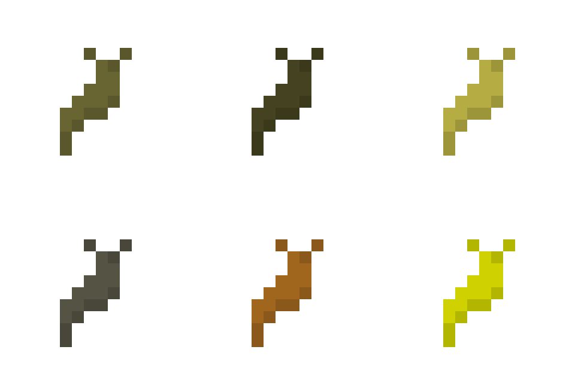

# large\_slugs

This is a mod for [Minetest][1] that adds large slugs of several species,
implemented as different nodes. They very slowly wander around, sticking to
surfaces, dying and asexually reproducing to balance their population. This
behavior can be tweaked or disabled if it becomes detrimental to performance.

## Species

Different species spawn on different surfaces, and their movement is restricted
to these different surfaces.

### Grass Slug

The light brown grass slug spawns on regular grass on the surface. It can only
move on grass and dirt.

Grass slugs can be cooked and eaten for two food points.

### Pine Slug

The dark brown pine slug spawns in pine forests. It can only move on dirt, pine
trees trunks, and the ground covering of the pine forests.

Pine slugs can be cooked and eaten for two food points.

### Rainforest Slug

The yellow-brown rainforest slug spawns in rainforests. It can only move on
dirt, jungle tree trunks, and the ground covering of the rainforests.

Rainforest slugs can be cooked and eaten for three food points.

### Cave Slug

The gray cave slug spawn at level -32 and below on stone. It can only move on
stone, cobblestone, and coal-bearing stone.

Cave slugs can be cooked and eaten for three food points. Two cave slugs can be
crafted into a lump of coal.

### Iron Slug

The rust-colored iron slug spawns at level -128 and below on stone. It can only
move on stone, cobblestone, and iron ore.

Two iron slugs can be crafted into a lump of iron.

### Mese Slug

The yellow mese slug spawns at level -512 and below on stone. It can only move
on stone, cobblestone, mese, and mese-bearing stone.

Three mese slugs can be crafted into a mese crystal fragment.

## Behavior

If behavior is enabled, an ABM runs every 5 seconds\* to update active slugs.
The updates are spread throughout the interval. Each interval, one out of every
5 slugs\* is actually updated. Each slug may check a radius of 5 nodes\* around
them and act based on the nearby population of their species. One out of 6\*
will choose to die if there is more than 1 other slug\* nearby. Of those
remaining, one out of 6\* will try to reproduce if there are 0 other slugs\*
nearby. Those that neither die nor try to reproduce will try to move.

\* These are default values. They can be changed in the settings.

## Mod dependencies

large\_slugs depends on either the mod "default" or the modpack "zero" for the
materials used. If neither is present, the mod will work but will basically do
nothing. The core of the mod in api.lua and behavior.lua does not depend on
anything.

The optional dependency on the mod "ethereal" is just to fix a bug. It seems
that large\_slugs must load after ethereal in order for slugs to spawn properly.
I'm not sure why.

## Licenses

### Source code

The source code of this project is licensed under the LGPL v3 (or later,)
as stated in the source code files themselves.

### Images and other files not otherwise licensed

These files are licensed under a [CC BY-SA 3.0 license][2].

They are also under the same copyright as the source files:

Copyright © 2021 Jude Melton-Houghton

[1]: https://www.minetest.net/
[2]: https://creativecommons.org/licenses/by-sa/3.0/
